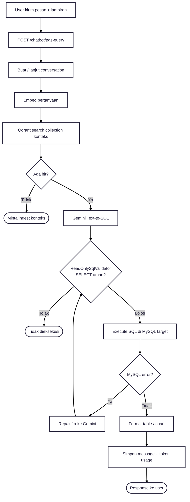
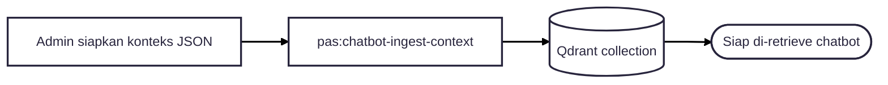

---
tags:
  - portfolio
  - flowchart
  - chatbot
  - S-tier
aliases:
  - Chatbot Flow
project: Chatbot
tier: S
slug: chatbot
platform: MyPAS
created: 2026-07-27
---

# Chatbot — Qdrant + Gemini + Query Execution

> [!info] One-liner
> Chat berkonteks: embed → **Qdrant retrieve** → Gemini Text-to-SQL → **ReadOnly SQL validator** → execute → jawab (table/chart).

**Parent:** [[00-Index|Portfolio Flowcharts]]  
**Brief:** `portofolio/projects/briefs/chatbot/`

---

## Flowchart — Pipeline aktif (`context_qdrant`)

---

## Flowchart — Admin ingest (supporting)

## Guardrails yang wajib diceritain

- Hanya SELECT (validator)
- Feature flag `pas_chatbot.enabled`
- Attachment size/MIME limit
- KAPAS monitor usage Gemini

## Entry points

- `routes/chatbot.php`
- `app/Services/PasChatbot/PasChatbotQueryService.php`
- `TextToSqlGeminiService.php`, `ReadOnlySqlValidator.php`
- Controllers: `app/Http/Controllers/PasChatbot/`
