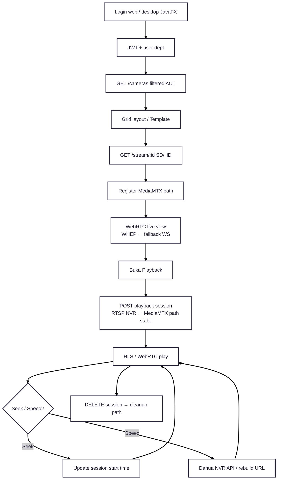
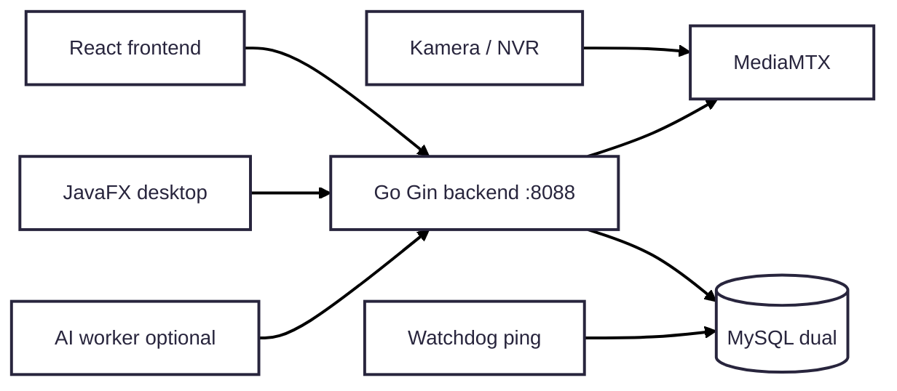

---
tags:
  - portfolio
  - flowchart
  - command-center
  - S-tier
  - desktop
aliases:
  - Command Center CCTV Flow
project: Command Center CCTV
tier: S
slug: command-center
platform: Standalone — /home/asrofil/Project/command_center
created: 2026-07-27
---

# Command Center CCTV — Desktop Java + Live + Seamless Playback

> [!info] One-liner
> Multi-CCTV command center: JWT + ACL kamera → MediaMTX WebRTC live grid → playback session seek/speed seamless. Web React + **Desktop JavaFX**.

**Parent:** [[00-Index|Portfolio Flowcharts]]  
**Brief:** `portofolio/projects/briefs/command-center/`

---

## Flowchart — Live + Playback

---

## Flowchart — Stack overview

## Privacy

> [!danger] Demo
> Blur area sensitif pabrik & wajah. Jangan expose layout security berlebih.

## Entry points

- `/home/asrofil/Project/command_center/Readme.md`
- `desktop/README.md`, `backend/main.go`
- `frontend/src/pages/{Dashboard,Playback}.tsx`
- `desktop/src/main/java/.../CommandCenterApp.java`
