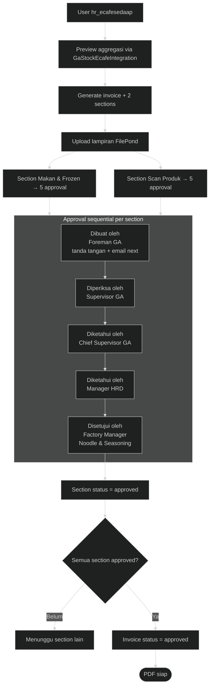

---
tags:
  - portfolio
  - flowchart
  - ecafe
  - A-tier
aliases:
  - E-Cafe Invoice Flow
project: E-Cafe Invoice
tier: A
slug: ecafe-invoice
platform: MyPAS
created: 2026-07-27
updated: 2026-07-28
---

# E-Cafe Invoice — Approval 5 Level

> [!info] One-liner
> Generate invoice e-cafe (Makan & Frozen + Scan Produk), approval **sequential 5 level per section**, email notifikasi, PDF.

**Parent:** [[00-Index|Portfolio Flowcharts]]  
**Brief:** `portofolio/projects/briefs/ecafe-invoice/`

## Approver chain (per section)

1. Dibuat oleh — Foreman GA
2. Diperiksa oleh — Supervisor GA
3. Diketahui oleh — Chief Supervisor GA
4. Diketahui oleh — Manager HRD
5. Disetujui oleh — Factory Manager Noodle & Seasoning

---

## Flowchart

## Catatan penting

- Level N aktif **hanya** jika level N−1 sudah tanda tangan.
- Section Makan & Produk **independen**; invoice approved = AND semua section.
- Integrasi: `GaStockEcafeIntegrationService`, email queue, FilePond storage.

## Entry points

- `app/Http/Controllers/HR/EcafeSedaapInvoiceController.php`
- `routes/hr.php` → `/hr/ecafesedaap/invoice*`
- Views: `resources/views/hr/ecafesedaap/invoice/`
