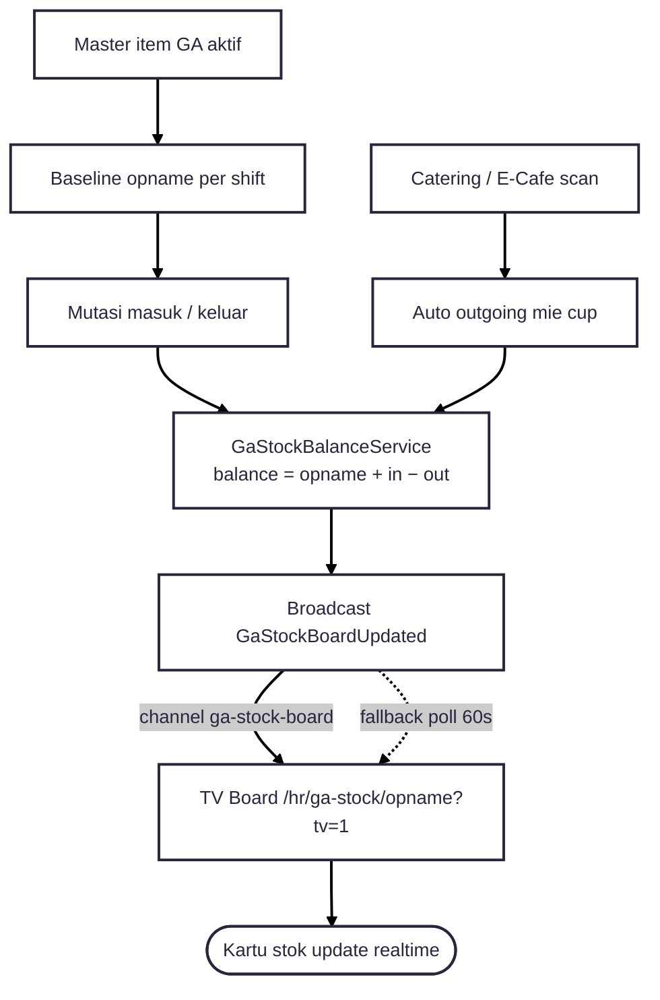

---
tags:
  - portfolio
  - flowchart
  - ga-stock
  - A-tier
aliases:
  - GA Stock Opname Flow
project: GA Stock Opname
tier: A
slug: ga-stock-opname
platform: MyPAS
created: 2026-07-27
---

# GA Stock Opname — TV Websocket Display

> [!info] One-liner
> Stock opname GA: baseline + mutasi in/out + catering → balance realtime di **TV board** via websocket (`ga-stock-board`).

**Parent:** [[00-Index|Portfolio Flowcharts]]  
**Brief:** `portofolio/projects/briefs/ga-stock-opname/`

> [!warning] Bukan FACStokOpname
> `fac/so` beda modul. Yang ini = `hr/ga-stock`.

---

## Flowchart

## Actors

- GA staff (`hr_ga_stock_*`)
- TV viewer (`?tv=1`)
- E-Cafe integration (sumber catering)

## Entry points

- Routes: `routes/hr-ga-stock.php`
- Event: `app/Events/HR/GaStock/GaStockBoardUpdated.php`
- TV: `resources/views/hr/ga-stock/opname/tv.blade.php`
