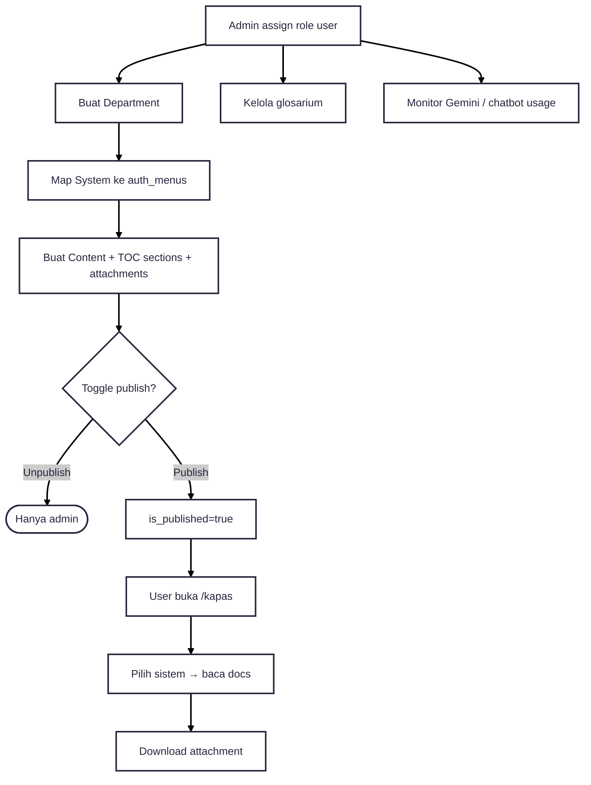

---
tags:
  - portfolio
  - flowchart
  - kapas
  - A-tier
aliases:
  - KAPAS Flow
project: KAPAS
tier: A
slug: kapas
platform: MyPAS
created: 2026-07-27
---

# KAPAS — Management + Performance + CMS

> [!info] One-liner
> Knowledge portal: department → system → content (CMS) → publish. Plus role mapping, glosarium, monitor chatbot/Gemini.

**Parent:** [[00-Index|Portfolio Flowcharts]]  
**Brief:** `portofolio/projects/briefs/kapas/`

> [!note]
> Tidak ada approval workflow konten (publish/unpublish = gate visibility).

---

## Flowchart — Publikasi dokumentasi

## Actors

- Admin KAPAS (full CRUD)
- User internal / external (read published)
- Authenticated visitor (landing + overview)

## Entry points

- `documentation/Asrofil/KAPAS_README.md`
- `routes/kapas.php`
- `app/Http/Controllers/KAPAS/`
- `app/Services/KAPAS/KapasContentService.php`
