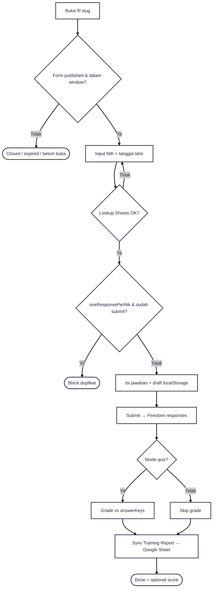
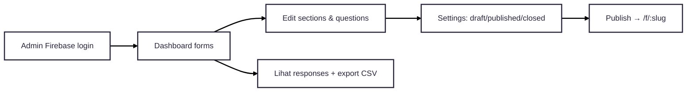

---
tags:
  - portfolio
  - flowchart
  - kms-form
  - compliance
  - A-tier
aliases:
  - KMS Form Flow
project: KMS Form
tier: A
slug: kms-form
platform: Standalone — /home/asrofil/Project/compliance-form-app
created: 2026-07-27
---

# KMS Form — Compliance Form App

> [!info] One-liner
> Form dinamis (survey/quiz) untuk compliance/training: validasi NIK via Google Sheets, simpan Firestore, grade quiz, sync laporan training.

**Parent:** [[00-Index|Portfolio Flowcharts]]  
**Brief:** `portofolio/projects/briefs/kms-form/`

---

## Flowchart — Peserta isi form

---

## Flowchart — Admin manage

## Status form

`draft → published → closed` · mode `survey | quiz`

## Entry points

- `/home/asrofil/Project/compliance-form-app/README.md`
- `src/pages/public/FormPage.jsx`
- `backend/app/api/{lookup-nik,grade-quiz,sync-training-report}/`
- Firestore + Google Sheets SA
