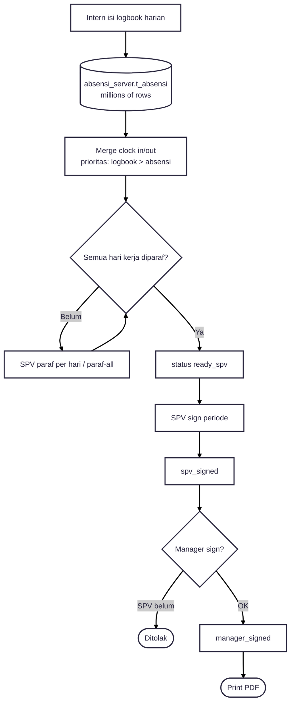

---
tags:
  - portfolio
  - flowchart
  - logbook
  - A-tier
aliases:
  - Logbook Flow
project: Logbook Magang
tier: A
slug: logbook
platform: MyPAS
created: 2026-07-27
---

# Logbook — Absensi Scale + Approval 2 Level

> [!info] One-liner
> Logbook magang: merge kegiatan harian + tap dari **`t_absensi` (jutaan row)**, lalu approval **SPV → Manager**.

**Parent:** [[00-Index|Portfolio Flowcharts]]  
**Brief:** `portofolio/projects/briefs/logbook/`

> [!note] Modul
> Ini **Magang Logbook** (`routes/magang.php`), bukan logbook lain.

## Status

`pending_paraf → ready_spv → spv_signed → manager_signed`

---

## Flowchart

## Actors

- Magang / Intern
- PIC / SPV (`role_level=spv`)
- Manager (`role_level=manager`)
- Admin Master Magang

## Entry points

- `routes/magang.php`
- `app/Http/Controllers/Magang/LogbookController.php`
- `app/Http/Controllers/Magang/ApprovalController.php`
- `app/Support/MagangLogbookApprovalRules.php`
