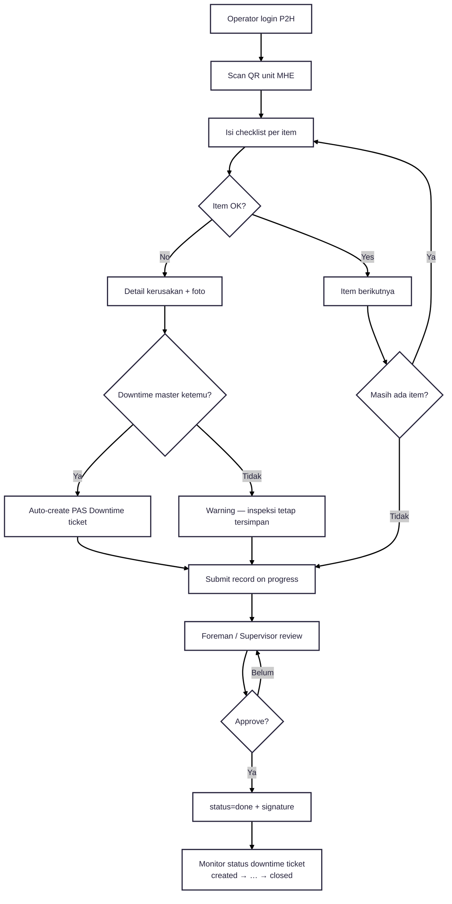

---
tags:
  - portfolio
  - flowchart
  - p2h
  - A-tier
aliases:
  - P2H Flow
project: P2H
tier: A
slug: p2h
platform: MyPAS
created: 2026-07-27
---

# P2H — Pemeliharaan / Inspeksi MHE + Downtime

> [!info] One-liner
> Operator scan QR MHE → checklist harian → item rusak auto-create **PAS Downtime ticket** → Foreman/Supervisor approve.

**Parent:** [[00-Index|Portfolio Flowcharts]]  
**Brief:** `portofolio/projects/briefs/p2h/`

---

## Flowchart

## Actors

| Role | Akses |
|------|-------|
| Operator | Scan QR + isi checklist |
| Foreman | Approve, PDF, dashboard |
| Supervisor | Approve + master inspeksi |

## Integrasi

- `CreateDowntimeTicketService` → PAS Downtime
- Telegram timeline saat approve
- PDF export

## Entry points

- `routes/p2h.php`
- `app/Http/Controllers/P2H/`
- `app/Services/P2H/CreateDowntimeTicketService.php`
