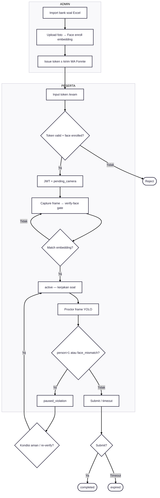
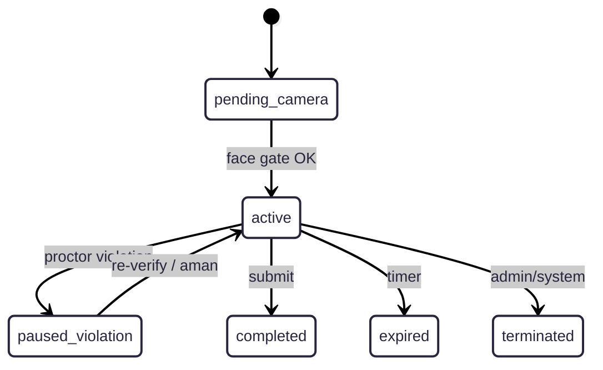

---
tags:
  - portfolio
  - flowchart
  - psikotes
  - S-tier
  - computer-vision
aliases:
  - Psikotes Flow
project: Psikotes
tier: S
slug: psikotes
platform: Standalone — /home/asrofil/Project/psikotes
created: 2026-07-27
---

# Psikotes — Computer Vision + Image Verification

> [!info] One-liner
> Ujian online + face enrollment/verify (InsightFace) + proctor YOLO (person count) + React/Laravel/MySQL.

**Parent:** [[00-Index|Portfolio Flowcharts]]  
**Brief:** `portofolio/projects/briefs/psikotes/`

---

## Flowchart — End-to-end

---

## Flowchart — Session states

## Privacy

> [!danger] Saat rekam demo
> Blur wajah kandidat real, KTP, data personal. Pakai dummy.

## Entry points

- `/home/asrofil/Project/psikotes/README.md`
- `routes/api.php`, `routes/admin.php`
- `python/proctor-service/` (YOLO + InsightFace)
