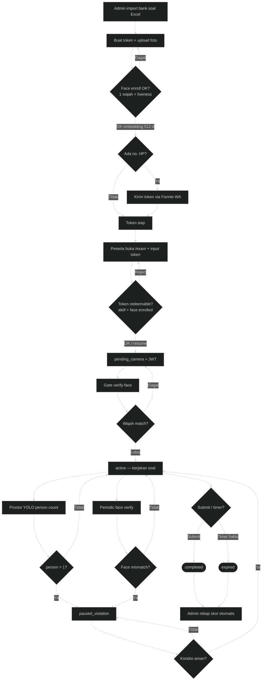

---
tags:
  - portfolio
  - flowchart
  - psikotes
  - S-tier
  - computer-vision
aliases:
  - Psikotes Flow
project: Psikotes
tier: S
slug: psikotes
platform: Standalone — /home/asrofil/Project/psikotes
created: 2026-07-27
updated: 2026-07-29
---

# Psikotes — Face enroll + YOLO proctor exam

> [!info] One-liner
> Ujian online: bank soal → token + face enroll (InsightFace) → WhatsApp (Fonnte) → gate verify → ujian + YOLO proctor → skor digital.

**Parent:** [[00-Index|Portfolio Flowcharts]]  
**Brief:** `portofolio/projects/briefs/psikotes/`  
**Code:** `/home/asrofil/Project/psikotes`

## Actors

Admin / HR-PIC · Peserta (token, tanpa akun) · Proctor service (YOLO + InsightFace) · Fonnte WhatsApp

## Session status

| Status | Artinya |
|--------|---------|
| `pending_camera` | Token masuk, menunggu face gate |
| `active` | Ujian berjalan |
| `paused_violation` | Multi-person / face mismatch |
| `completed` | Submit sukses |
| `expired` | Timer habis |

---

## Flowchart — proses bisnis

**SVG:** `flowchart.svg`

## Entry points

- `README.md`
- `routes/admin.php`, `routes/api.php`, `routes/web.php`
- `python/proctor-service/` — `/enroll`, `/verify`, `/detect`
- Services: `FaceEnrollmentService`, `FaceVerificationService`, `ViolationHandler`, `FonnteGateway`
