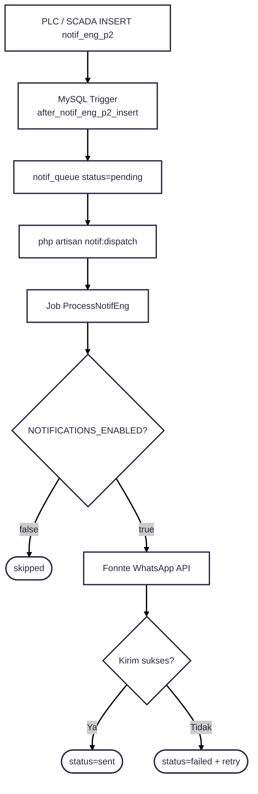
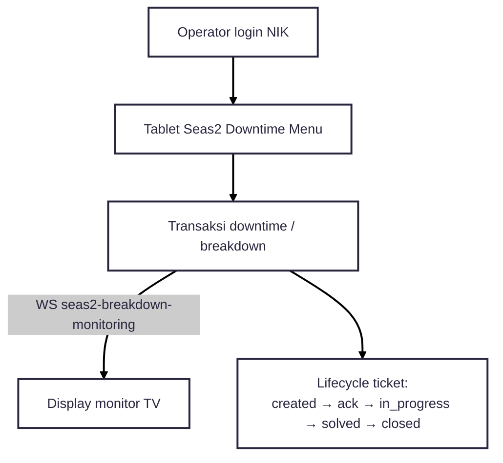
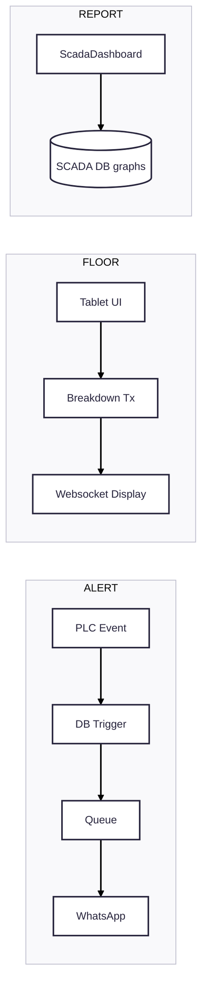

---
tags:
  - portfolio
  - flowchart
  - scada
  - S-tier
aliases:
  - SCADA to Tablet Flow
project: SCADA to Tablet
tier: S
slug: scada-tablet
platform: MyPAS
created: 2026-07-27
---

# SCADA to Tablet — Trigger + WhatsApp + Websocket

> [!info] One-liner
> Pipeline event SCADA/DB → **MySQL trigger** → queue → **Fonnte WhatsApp**, plus jalur tablet downtime & display websocket.

**Parent:** [[00-Index|Portfolio Flowcharts]]  
**Brief:** `portofolio/projects/briefs/scada-tablet/`

> [!note] Multi-lane
> Di codebase ini ada beberapa jalur yang saling nempel. Diagram utama = Lane A (WA via trigger). Lane B/C supporting.

---

## Flowchart — Lane A (portfolio hook utama)

---

## Flowchart — Lane B + C (Tablet & Display)

---

## Flowchart — Overview gabungan (buat PPT)

## Entry points

- `app/Jobs/ProcessNotifEng.php`
- `app/Console/Commands/DispatchNotifEngJobs.php`
- `app/Services/WhatsApp/FonnteService.php`
- `routes/seas_2_downtime.php`, `routes/scada-dashboard.php`
- Docs: `deploy/supervisor/README.md`
