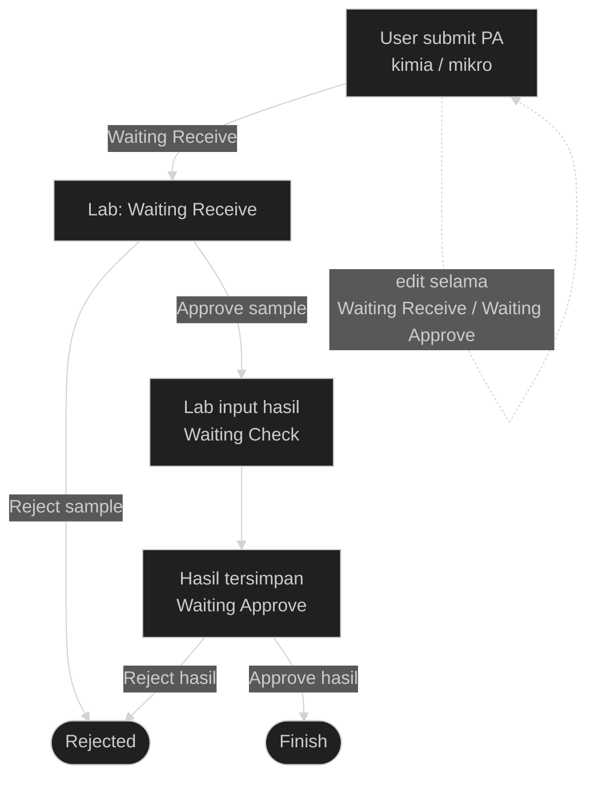
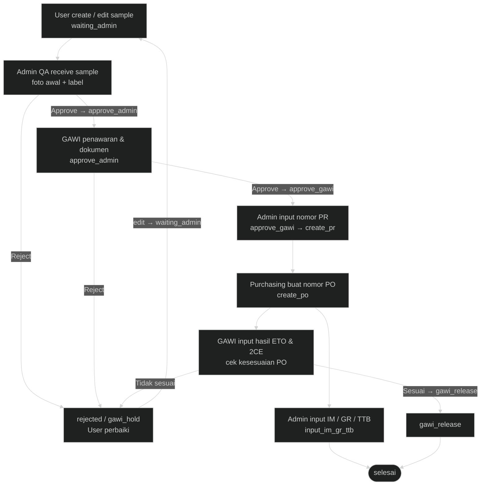
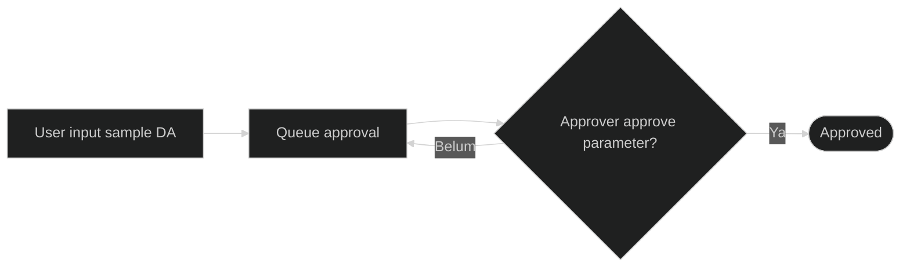

---
tags:
  - portfolio
  - flowchart
  - smart-lab
  - S-tier
aliases:
  - Smart Lab Flow
project: Smart Lab
tier: S
slug: smart-lab
platform: MyPAS
created: 2026-07-27
updated: 2026-07-28
---

# Smart Lab — PA + Lab Eksternal

> [!info] One-liner
> Sistem lab: **Permintaan Analisis (PA)**, **Daily Activity (DA)**, dan **Lab Eksternal** (vendor + purchasing).

**Parent:** [[00-Index|Portfolio Flowcharts]]  
**Brief:** `portofolio/projects/briefs/smart-lab/`

## Actors

User dept · Approval/Lab · QA Admin/ETO · GAWI · Purchasing · Master admin

---

## Flow A — Permintaan Analisis (PA)

Status sample (derived dari flag `is_approve` / `is_simpan` / `is_approve_hasil`):

| Status | Artinya |
|--------|---------|
| Waiting Receive | Sample baru, menunggu lab terima |
| Waiting Check | Sample diterima, lab input hasil |
| Waiting Approve | Hasil tersimpan, menunggu approve hasil |
| Finish | Hasil disetujui |
| Rejected | Ditolak saat receive **atau** saat approve hasil |

User boleh **edit** sample selama status `Waiting Receive` atau `Waiting Approve`.

**SVG:** `flowchart.svg` (gallery: Permintaan Analisis)

---

## Flow B — Lab Eksternal

Status dari `App\SmartLab\LabEksternalStatus`:

| Code | Label UI |
|------|----------|
| `waiting_admin` | Diproses Admin |
| `approve_admin` | Diproses Gawi |
| `approve_gawi` | Admin buat PR |
| `create_pr` | Diproses Purchasing |
| `create_po` | Diproses Purchasing |
| `input_im_gr_ttb` | Admin Input No IM GR |
| `gawi_release` | Gawi Release (menunggu Admin TTB) |
| `gawi_hold` | Ditolak |
| `rejected` | Ditolak |
| `selesai` | Selesai |

**Loop perbaikan:** Admin QA reject **atau** GAWI reject → `rejected` → user edit sample → reset ke `waiting_admin` (bisa berulang sampai approve). `gawi_hold` juga bisa diedit user → `waiting_admin`.

**SVG:** `flowchart_lab-eksternal.svg` (gallery: Lab Eksternal)

---

## Flow C — Daily Activity (ringkas)

## Entry points

- Routes: `routes/smart_lab/`
- Controllers: `app/Http/Controllers/SmartLab/`
- Status LE: `app/SmartLab/LabEksternalStatus.php`
