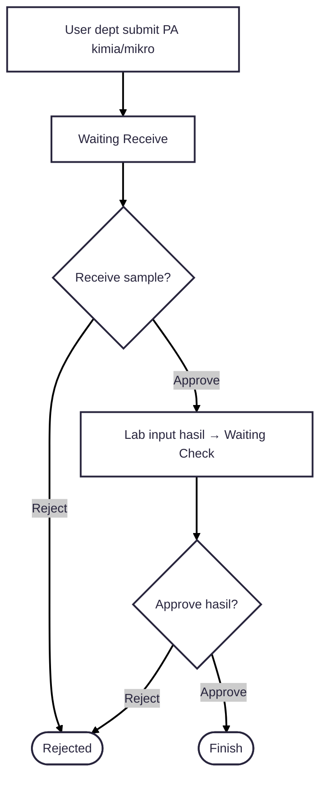
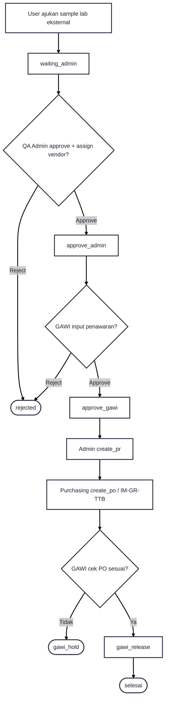
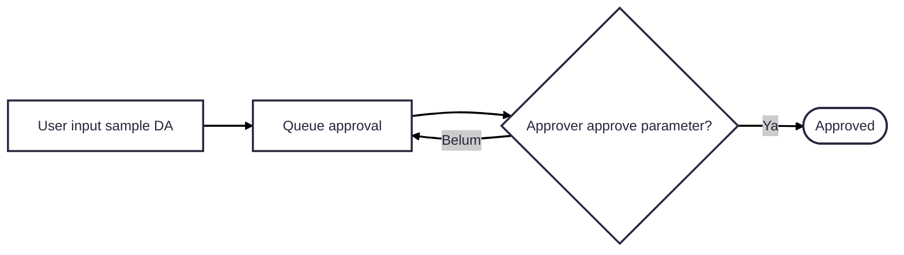

---
tags:
  - portfolio
  - flowchart
  - smart-lab
  - S-tier
aliases:
  - Smart Lab Flow
project: Smart Lab
tier: S
slug: smart-lab
platform: MyPAS
created: 2026-07-27
---

# Smart Lab — PA + Lab Eksternal

> [!info] One-liner
> Sistem lab: **Permintaan Analisis (PA)**, **Daily Activity (DA)**, dan **Lab Eksternal** (vendor + purchasing).

**Parent:** [[00-Index|Portfolio Flowcharts]]  
**Brief:** `portofolio/projects/briefs/smart-lab/`

## Actors

User dept · Approval/Lab · QA Admin/ETO · GAWI · Purchasing · Master admin

---

## Flow A — Permintaan Analisis (PA)

---

## Flow B — Lab Eksternal

---

## Flow C — Daily Activity (ringkas)

## Status cheat sheet

| Flow | Status |
|------|--------|
| PA | Waiting Receive → Waiting Check → Waiting Approve → Finish / Rejected |
| Lab eksternal | waiting_admin → … → gawi_release → selesai (branch: rejected, gawi_hold) |

## Entry points

- Routes: `routes/smart_lab/`
- Controllers: `app/Http/Controllers/SmartLab/`
- Status: `app/SmartLab/LabEksternalStatus.php`
