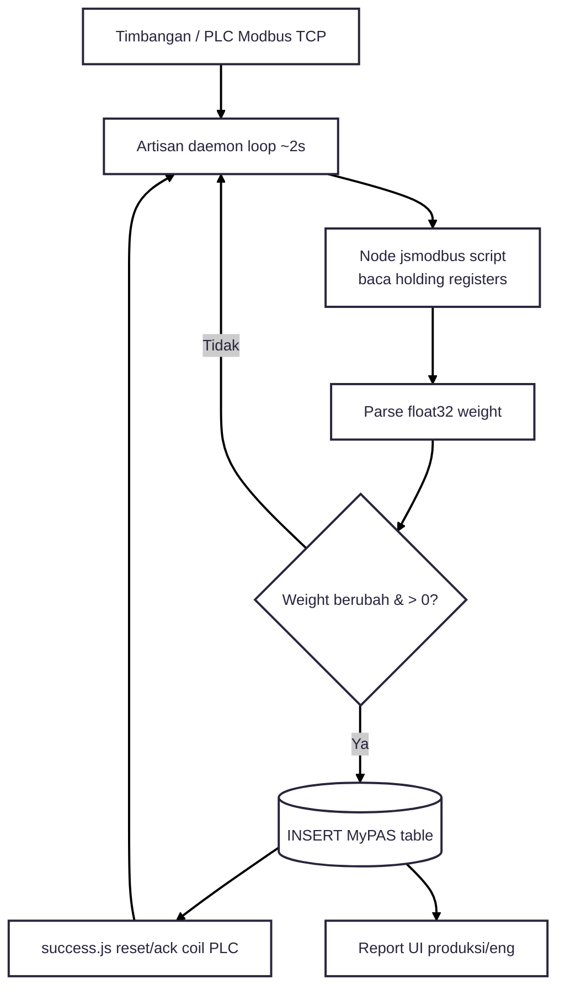

---
tags:
  - portfolio
  - flowchart
  - timbangin
  - modbus
  - A-tier
aliases:
  - TimbanginIN Flow
project: TimbanginIN
tier: A
slug: timbangin
platform: MyPAS + Node Modbus
created: 2026-07-27
---

# TimbanginIN — Modbus + Realtime Scale + Node.js

> [!info] One-liner
> Daemon Laravel loop → Node **jsmodbus** baca timbangan TCP → insert DB saat weight berubah → ack/reset coil PLC.

**Parent:** [[00-Index|Portfolio Flowcharts]]  
**Brief:** `portofolio/projects/briefs/timbangin/`

> [!note]
> Tidak ada slug literal `TimbanginIN` di repo. Ini keluarga artisan `*-get-weight` + `public/node/modbus/*.js`.

---

## Flowchart

## Contoh command

| Scale | Artisan |
|-------|---------|
| Bumbu N1 | `prn1-timbangan-bumbu:get-weight` |
| Bumbu N2 | `timbangan-bumbu-noodle-2:get-weight` |
| Waste Outer | `timbangan-waste-outer:get-weight` |

## Entry points

- `public/node/modbus/timbangan-*.js`
- Artisan commands Noodle1/Noodle2 get-weight
- Simulator (dev): `/home/asrofil/Project/modbus`
