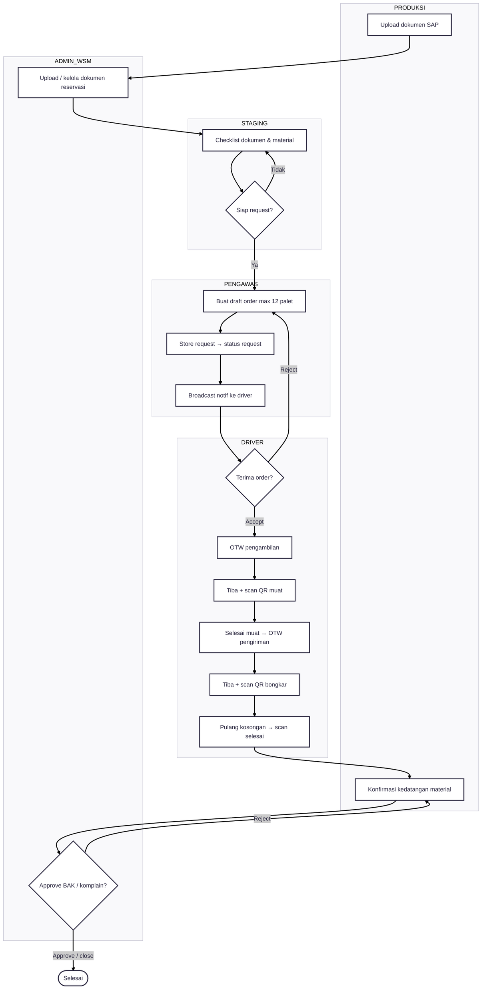
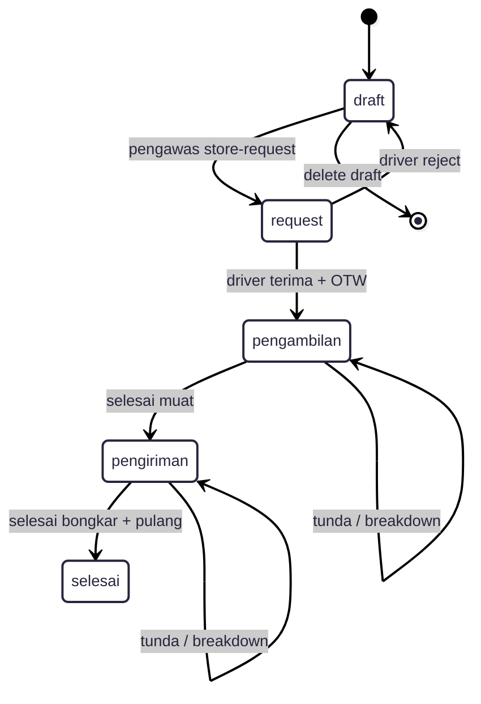

---
tags:
  - portfolio
  - flowchart
  - tms
  - S-tier
aliases:
  - TMS Flow
project: TMS
tier: S
slug: tms
platform: MyPAS
created: 2026-07-27
---

# TMS — Transportation Management System

> [!info] One-liner
> Sistem transportasi internal paling kompleks: SAP → staging → request pengawas → driver → scan muat/bongkar → selesai (+ maps realtime).

**Parent:** [[00-Index|Portfolio Flowcharts]]  
**Brief:** `portofolio/projects/briefs/tms/`

## Actors

| Actor | Peran |
|-------|-------|
| Produksi | Upload dokumen SAP, konfirmasi kedatangan |
| Admin WSM | Dokumen reservasi, approve BAK/komplain |
| Staging | Checklist material siap request |
| Pengawas | Draft/request order (maks 12 palet) |
| Driver | Terima order, muat, kirim, bongkar, pulang |
| Operator / Maps | Monitoring |

## Status utama

`draft → request → pengambilan → pengiriman → selesai` (+ reject / tunda)

---

## Flowchart — Happy Path Outgoing

> [!tip] Copy block di bawah ke Mermaid.ai

---

## Flowchart — Status State Machine

## Integrasi

- SAP dokumen reservasi
- WebSocket notifikasi driver + maps realtime
- QR scan lokasi muat/bongkar
- Auto logout shift

## Entry points

- Docs: `documentation/Andaru/14. FSD Transportation Management System.md`
- Routes: `routes/tms/`
- Controllers: `app/Http/Controllers/TMS/`
