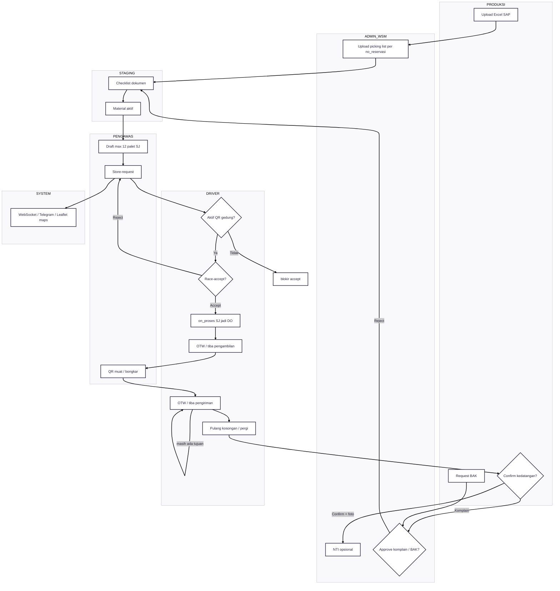
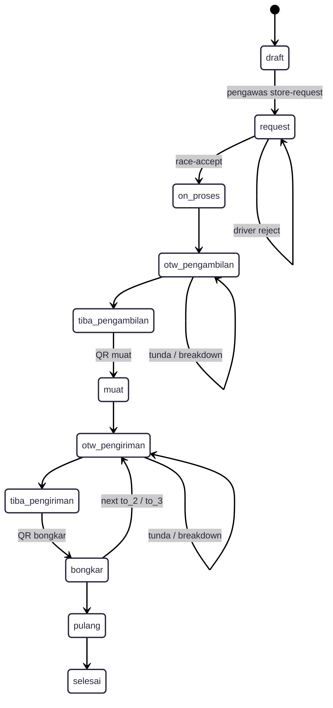

---
tags:
  - portfolio
  - flowchart
  - tms
  - S-tier
aliases:
  - TMS Flow
project: TMS
tier: S
slug: tms
platform: MyPAS
created: 2026-07-27
---

# TMS — Transportation Management System

> [!info] One-liner
> Sistem transportasi internal paling kompleks: SAP Excel + picking WSM + staging → draft pengawas → race-accept driver → QR muat/bongkar → maps realtime.

**Parent:** [[00-Index|Portfolio Flowcharts]]  
**Brief:** `portofolio/projects/briefs/tms/`

## Actors

| Actor | Peran |
|-------|-------|
| Produksi | Upload Excel SAP, konfirmasi kedatangan / komplain |
| Admin WSM | Picking list per `no_reservasi`, NTI, approve BAK/komplain |
| Staging | Checklist material siap request (`aktif`) |
| Pengawas | Draft/request order (maks 12 palet), QR muat/bongkar |
| Driver | Race-accept, OTW/tiba, scan muat/bongkar, pulang |
| Operator / Maps | TrackTruck Leaflet + WebSocket |

## Status aktual

`draft → request → on_proses → otw_pengambilan → tiba_pengambilan → muat → otw_pengiriman → tiba_pengiriman → bongkar → pulang → selesai`

Reject tetap `request`. Tunda / tolak / breakdown + foto EJO sebagai cabang. Multi tujuan: `to` / `to_2` / `to_3`.

---

## Flowchart — Outgoing + cabang

SVG: `projects/briefs/tms/diagram/flowchart.svg` (cache `?v=3`)

> [!tip] Copy block di bawah ke Mermaid.ai

---

## Flowchart — Status State Machine

## Activity + DFD

- Activity swimlane: `projects/briefs/tms/diagram/activity-diagram.svg`
  Produksi | Admin WSM | Staging | Pengawas | Driver | System
- DFD: `projects/briefs/tms/diagram/dfd.svg`
  Store: `tms_material_reservasi`, `tms_material_reservasi_wsm`, merge tables, `tms_transaction`, `tms_driver`/`tms_car`, `tms_master_konversi_palet`

## Integrasi

- SAP dokumen reservasi (Excel)
- WebSocket notifikasi driver + maps realtime
- Leaflet TrackTruck / TrackTruckProses
- QR scan lokasi muat/bongkar (pengawas atau gedung)
- Telegram sepanjang trip
- Auto logout shift

## Entry points

- Docs: `documentation/Andaru/14. FSD Transportation Management System.md`
- Routes: `routes/tms/`
- Controllers: `app/Http/Controllers/TMS/`
